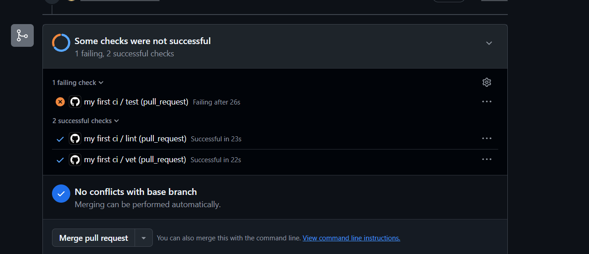
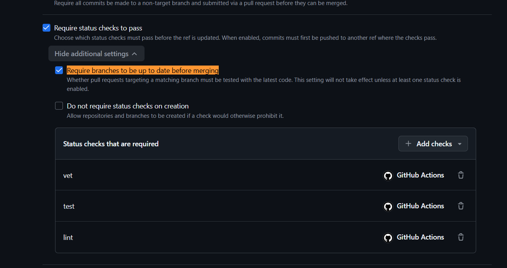
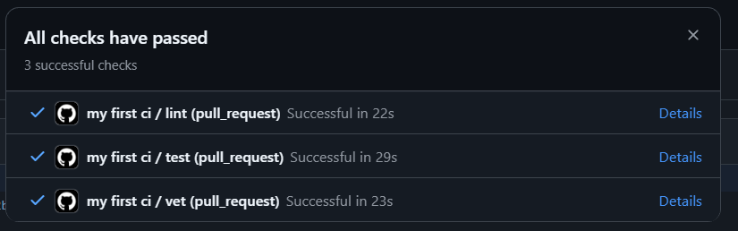
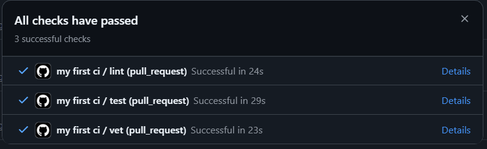
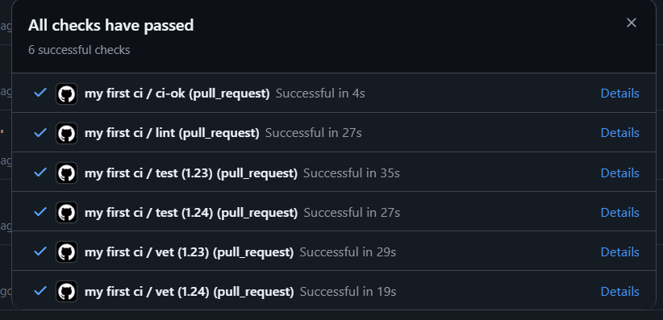

### Which path you picked (GitHub or GitLab) and why

Github. I have an expirience with gitlab on wy work already, so whant to learn new instrument

### Link to a green CI run

[link](https://github.com/tikhonmakeev/DevOps-Intro/pull/1)

### Screenshot or log of the failed run from 1.5, plus the fix commit

fix commit: [2e6a9872f1d7c507f222bbe2ecdaf0550fb35b58](https://github.com/tikhonmakeev/DevOps-Intro/pull/1/changes/2e6a9872f1d7c507f222bbe2ecdaf0550fb35b58)

### Branch-protection screenshot

### Written answers to all 5 design questions in 1.2

#### a) Why pin the runner version (ubuntu-24.04) instead of ubuntu-latest? What breaks otherwise?

Sometimes version changes. So pipeline may break just because of new ubuntu version release without your bugs.

#### b) Why split vet + test + lint into separate units? What would happen with one combined job?

They have different time to work, different logs, statuses. If it is one job, you never know what failed while not open logs. Plus sometimes I want to see all results of all jobs even if one failed -- different jobs can do this separation.

#### c) GH path: what real attack does SHA pinning prevent? Cite the date + name of the incident from Lecture 3

It prevents tag version replacement. March of 2025 tj-actions/changed-files supply-chain incident

#### d) GH path: what is permissions: and what's the principle behind it?

It is used to modify permissions of GITHUB_TOKEN -- adding or removing access. The principle "least privilege" is easy: always give minimal permissions.

#### e) GitLab path: what's the difference between a stage and a job? What would dependencies: do that stages: doesn't?

All jobs at one stage work in parallel. And stages runs one by one. Dependencises is not about execution order -- it shows what artefact job need to download

### The 3-row timing table above

 Of cource CI is longer with more versions check.

### Design questions for Task 2:
#### f) Why cache go.sum-keyed inputs and not build outputs?
inputs in go.sum it is dependencies. While they keeped unchange -- build modules can be the same -- so we can use the same cache. Output can not be so easily cached any build flag, OS or file change -- and old cache is useless or even bad. 

#### g) What does fail-fast: false change in a matrix run, and when do you actually want fail-fast: true?

This flag shows if we want to stop all versions chacks if one of versions failed in steps. We use `true` to save minutes of runners: for example big matrix of crossplatform E2E test -- so bug already found we need to fix it already, no need to spend budget

#### h) What's the risk of an attacker writing a cache from a malicious PR that protected branches later read? (Hint: GH has mitigations — find the official doc on this)

Job on main can use cache of different branch. So attacker or fork can make same go.sum cache and put malicious script. On next merge to main it will run and do something bad.

